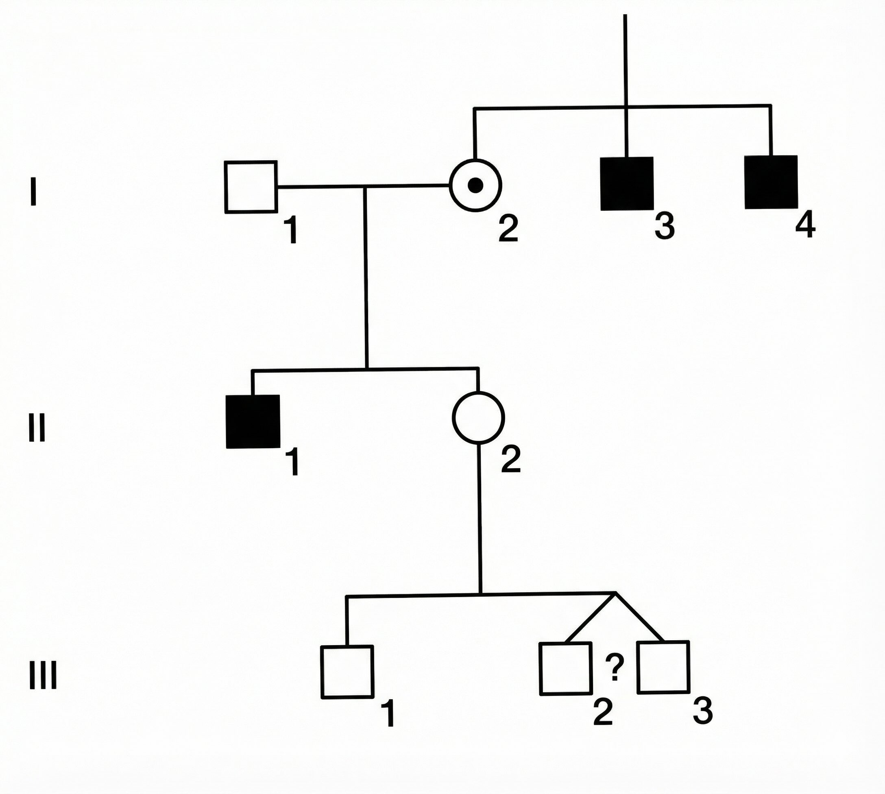

::: {.hidden}
$$
 \def\then{\mathbin{;}}
 \def\kernel{\rightsquigarrow}
$$
:::

# Introduction

Let's play a game. I'm carrying a mystery object. Your goal is to guess what it is. I will reveal that the object can be described by three properties — its *material*, *shape*, and *weight*:

:::{.half-width}

| Property | Possible values |
|----------|----------------|
| Material | {rubber, gold} |
| Shape    | {sphere, ring} |
| Weight   | {1g, 10g, 100g} |

:::

Even before I give you any more information, you might already have some beliefs about what combinations are more likely than others. For instance, you might believe it's more likely that the object is made of rubber than gold, because rubber objects are more common. You might also believe that if the object is a sphere, it's more likely to be made of rubber. 

How strongly do you favor object $x$ over $y$? One way to measure this: ask yourself what odds you would offer. If you would bet \$2 on $x$ against \$1 on $y$, then you believe $x$ is twice as likely.

Now suppose you've chosen a combination of properties. I will reveal a clue.

**Clue 1: The object is a ring.**

What changes? If you previously bet on a sphere, you should switch — spheres have been ruled out. But if you already bet on a ring, should you change anything? How would confirming that the object is a ring change your beliefs about the remaining properties?

Let's reveal another clue.

**Clue 2: The object weighs 10g.**

Now we can eliminate all objects that don't weigh 10g. We're left with just 2 possibilities: a rubber ring weighing 10g, or a gold ring weighing 10g. Which one seems more likely?

Notice what we did: we started with a list of all possible objects and a belief about how likely each one was. Then, as we received new information, we *eliminated* the possibilities that were incompatible with the clues and *redistributed* our belief among the survivors. This process of updating beliefs in light of new evidence is called **conditioning on observed data**. It is the central operation in probabilistic reasoning.

## Probability basics
Let's formalize our reasoning in the guessing game. We start with a finite set $\Omega$ of **possible world states**. For the guessing game, $\Omega$ could be the set of all 12 possible combinations of material, shape, and weight. The important thing is that $\Omega$ includes all the distinctions we care about.

We call any subset $E \subseteq \Omega$ an **event**. An event picks out those world states in which some property holds. For instance, in the guessing game, the event "the object is a ring" is the set of all states $\omega \in \Omega$ where the shape is a ring. 

Logical operations on events correspond to set operations:

- **and**: The event "$E_1$ and $E_2$" corresponds to the intersection $E_1 \cap E_2$ — the states where both properties hold.
- **or**: The event "$E_1$ or $E_2$" corresponds to the union $E_1 \cup E_2$ — the states where at least one holds.
- **not**: The event "not $E$" corresponds to the complement $E^\text{c} = \Omega \setminus E$ — the states where $E$ fails to hold.

We assign every subset $E \subseteq \Omega$ a number $p(E)$ that captures how likely we think $E$ is. If our assignment satisfies the following two properties, we call $p$ a **probability measure / distribution** on $\Omega$:

1. **Normalization.** $p(\emptyset) = 0$ and $p(\Omega) = 1.$ We could choose a different scale, but this is the most convenient one. 

2. **Additivity.** Whenever $E_1$ and $E_2$ have no elements in common, we have $p(E_1 \cup E_2) = p(E_1) + p(E_2).$ Such events are called *mutually exclusive* because they can't both happen at the same time. Additivity says that the probability of either $E_1$ or $E_2$ happening is the sum of their individual probabilities.

It $E \subseteq F$, we can write $F = E \cup (F \setminus E)$, so that by additivity $p(E) \leq p(F)$. Additivity also implies that the probability of $E$ *not* happening is $p(E^\text{c}) = 1 - p(E)$. 

<!-- This section could be improved -->
Since any set is the union of its individual elements, we get $p(E) = \sum_{e \in E} p(\{e\})$. In other words, the probability of any event is determined by the probabilities of individual states. To simplify notation, we write $p(\omega) := p(\{\omega\})$ for any element $\omega \in \Omega$. The function $p : \Omega \to [0, 1]$ that assigns a probability to each state is called a **probability density function** (pdf). It satisfies $p(E) = \sum_{\omega \in E} p(\omega)$ and $\sum_{\omega \in \Omega} p(\omega) = 1$. Conversely, any function $q : \Omega \to [0, 1]$ that sums to 1 defines a probability measure by $q(E) = \sum_{\omega \in E} q(\omega)$.

### Conditioning

The key operation in our guessing game was eliminating impossible states. Suppose we learn that the true state lies in some subset $F \subseteq \Omega$. For instance, $F$ might be the set of all ring-objects. How should we update our probabilities?

States outside $F$ are now impossible, so they should receive probability zero. Among the states inside $F$, we have no new reason to prefer one over another, so their relative likelihood should remain unchanged. Hence, we simply replace each event $E \subseteq \Omega$ by $E \cap F$ to remove any impossible states. Finally, we need to divide by $p(F)$ to *renormalize*, so that these new probabilities take values between 0 and 1.
$$
p(E \mid F) := \frac{p(E \cap F)}{p(F)}.
$$

This process is called **conditioning** on $F$. The expression $p(E \mid F)$ is **the conditional probability of $E$ given $F$**.

### Random variables

So far we have been talking about subsets of $\Omega$. In practice, we usually care about specific *properties* of the world. For instance, we might only care about the shape of the object. We can think of this as a function $S : \Omega \to \{\text{sphere}, \text{ring}\}$ that maps each state to its shape.

A **random variable** $X : \Omega \to \mathcal{X}$ maps each world state $\omega$ to a value $X(\omega)$ in some set $\mathcal{X}$. We introduce new notation for the probability that $X$ takes a particular value $x$:

$$
p(X = x) := p(\{\omega \in \Omega : X(\omega) = x\}).
$$

This is called the **distribution** of $X$. It is just our earlier definition applied to the subset of states where $X$ equals $x$. When it is clear from context, we write $p(x)$ instead of $p(X = x)$ following the convention of writing uppercase letters for random variables and the corresponding lowercase letters for their values.

Every event $E$ can be thought of as a random variable $E : \Omega \to \{0, 1\}$ that maps each state $\omega$ to 1 if $\omega \in E$, and 0 otherwise. Hence the random variables include events as a special case.

#### Joint distributions {.unnumbered}

We write the **joint distribution** of two random variables $X$ and $Y$ as:

$$
p(x, y) := p(X = x \text{ and } Y = y).
$$

The joint distribution tells us the probability of each combination of values. For instance, $p(\text{gold}, \text{ring})$ is the probability that the object is both gold and a ring.

In this notation, the conditional probability of $X = x$ given $Y = y$ is written as

$$
p(x \mid y) = \frac{p(x, y)}{p(y)}.
$$

Rearranging the above gives us the **chain rule** for two variables:
$$
p(x, y) = p(x \mid y) \, p(y).
$$

By applying the chain rule to the probability measure $p(- \mid z)$, we get a more general version of the chain rule that holds given any background condition $Z = z$:
$$
p(x, y \mid z) = p(x \mid y, z) \,p(y \mid z).
$$

As a general rule, any identity that holds without conditioning also holds given $Z = z$.


### Bayesian inference

We can now describe the general recipe for reasoning under uncertainty.

**Step 1: Build a generative model.** Specify a joint distribution $p(x, y)$ that describes all quantities of interest — both hidden and observable. This is called a **generative model** because it tells a story about how the data came to be. In the guessing game, the generative model must specify $p(m,s,w)$, the probability of each combination of material, shape, and weight. Often the chain rule is used to break down the joint distribution into simpler pieces.

**Step 2: Condition on observed data.** Once we observe $y$, compute the **posterior distribution** $p(x \mid y)$ by conditioning. This tells us what we should believe about $x$ in light of the evidence $y$.

That's it, at least in principle. Bayesian inference is the process of building a generative model and then conditioning it on observed data to update our beliefs. Everything that follows in this course is an instance of this simple pattern. The challenge lies in carrying out each step: as our models grow more complex, both specifying the joint distribution and computing the posterior become harder. The rest of this section introduces two tools that help: **conditional independence** simplifies the task of building joint distributions (Step 1), and **Bayes' rule** provides a way to compute the posterior when the model is specified in a particular direction (Step 2).

### Conditional independence

When building a generative model, we need to specify the joint distribution over all variables of interest. For many variables, this quickly becomes intractable — a joint distribution over $n$ binary variables has $2^n - 1$ free parameters. Conditional independence provides a way to factor the joint into manageable pieces.

Two random variables $X$ and $Y$ are **conditionally independent given $Z$** if 
$$
p(x \mid y , z) = p(x \mid z).
$$

This means that once we know $Z$, learning $Y$ gives no additional information about $X$. In this case, the chain rule simplifies to

$$ 
p(x, y \mid z) = p(x \mid z) \, p(y \mid z).
$$

Conditional independence assumptions allow us to decompose a complex joint distribution into a product of simpler conditional distributions — each of which may involve only a few variables. This decomposition is the key to building tractable generative models.

### Bayes' rule

<!-- This section could be improved. Should focus on what pieces of information are usually available to the modeler. -->

Once we have a joint distribution, we need to condition it on the observed data. Sometimes the conditional $p(x \mid y)$ we want is not directly available from the way we built the model. For instance, a generative model typically specifies how data $d$ arises from a hidden state $h$ — i.e., $p(d \mid h)$ — but we want the reverse: $p(h \mid d)$. Bayes' rule lets us flip the direction of conditioning.

Since the joint distribution is symmetric — $p(h, d) = p(d, h)$ — applying the chain rule gives **Bayes' rule**:
$$
p(h \mid d) = \frac{p(h, d)}{p(d)} = \frac{p(d \mid h) \, p(h)}{p(d)}.
$$

In Bayesian terminology, $p(h)$ is called the **prior distribution** — our beliefs about $h$ before seeing any data. The term $p(d \mid h)$ is called the **likelihood** — how likely we would be to see the data if $h$ were true. The denominator $p(d)$ is called the **evidence** — the total probability of the observed data. Finally, $p(h \mid d)$ is called the **posterior distribution** — our updated beliefs about $h$ after seeing the data.

The denominator $p(d)$ is often not directly available but can be computed by summing the joint distribution over all possible values of $h$. This is the **marginalization** identity:

$$
p(d) = \sum_{h \in \mathcal{H}} p(h, d) = \sum_{h \in \mathcal{H}} p(d \mid h) \, p(h).
$$

It holds since $\{\omega : D(\omega) = d\}$ can be written as a union $\bigcup_{h \in \mathcal{H}} \{\omega : H(\omega) = h, D(\omega) = d\}$ of mutually exclusive events.

Notice that $p(h \mid d) \propto p(h, d)$ when viewed as a function of $h$ for a fixed $d$ — the denominator $p(d)$ is the same for every $h$. This means we can compute $p(h \mid d)$ in two steps: first compute the unnormalized values $p(h, d)$ for each $h$, then divide by their sum to normalize. This "compute then normalize" strategy is a recurring pattern in probabilistic inference.

## String diagrams

We will now describe a convenient way to build and reason about generative models using **string diagrams**. This lets us manipulate complex models visually, without tedious algebra. Two examples of string diagrams are shown below. The one on the left represents a typical causal model. The one on the right illustrates other syntactic possibilities.

``` {.tikz file="intro/string-diagrams.tikz"}
%%| label: string-diagrams
%%| fig-cap: Two examples of string diagrams.
%%| height: 7.5em
```

String diagrams consist of boxes that are connected by wires. You can imagine information flowing through the wires from left to right. Diagrams are *open*: they can have input wires entering from the left and output wires leaving on the right. The boxes represent processes that transform information. You can think of them as random functions that take an input and produce an output according to some distribution. In the next chapter, we will make this interpretation precise.

Boxes can have any number of input and output wires. We think of boxes with no inputs as **generators** and boxes with no outputs as **evaluators**. Wires are allowed to cross. The point where this happens is called a **swap**. Moreover, the black **copy** and **delete** nodes allow us to split and terminate wires. You should think of copy nodes as perfectly duplicating the information in the wire, while delete nodes throw the information away. Here is a summary of the visual elements used to construct string diagrams:

``` {.tikz file="intro/string-diagram-elements.tikz"}
%%| label: string-diagram-elements
%%| fig-cap: The visual elements used to construct string diagrams.
%%| height: 2.5em
```

String diagrams encode the structure of our model and make it easy to see which variables depend on each other. We will see in the next chapter how to read off conditional independence assumptions from the diagram, and how to use it to organize calculations.

A key feature of string diagrams is that only their connectivity matters for determining their meaning. For instance, the following diagrams are considered the same:

```{.tikz file="intro/deformations.tikz"}
%%| label: deformations
%%| fig-cap: These string diagrams that are considered the same because they can be deformed into each other without breaking any connections.
%%| height: 5.5em
```

A good way to imagine the allowed deformations is to think of the wires as rubber bands and the boxes as solid tiles. The wires are pinned to the boxes and to the perimeter of the diagram, but they can be freely stretched and bent in between. We can now slide the boxes around as long as we don't break the anchor points. One rule we must respect is that our deformations should not introduce backwards flow of information. In other words, we should not move a box to the left of any of its inputs. For example, the following deformation is not valid:

``` {.tikz file="intro/invalid-deformation.tikz"}
%%| label: invalid-deformation
%%| fig-cap: An invalid deformation of a string diagram that introduces backwards flow of information.
%%| height: 5.5em
```

Finally, string diagrams can be used for calculations. We can manipulate them according to certain rules to derive new diagrams that represent the same process. For instance, the following identities always hold:

``` {.tikz file="intro/example-identities.tikz"}
%%| label: example-identities
%%| fig-cap: Some identities that hold for string diagrams.
%%| height: 2.5em
```

Both of them are intuitive if we consider information flow. The left identity says that if we copy some information and delete one copy, it is the same as not doing anything. The right identity says that if we swap two wires and then swap them back, it's the same as not doing anything.

Sometimes certain identities hold for specific types of boxes. For instance, the following identity holds for any box $f$ that is normalized, i.e. represents a conditional probability distribution:

``` {.tikz file="intro/normalization-identity.tikz"}
%%| label: normalization-identity
%%| fig-cap: An identity that holds for any normalized box $f$.
%%| height: 2.5em
```

It says that if we transform an input by $f$ and then delete the result, it's the same as directly deleting the input. Most boxes we will encounter are normalized and hence satisfy this property.

We will see more examples of ways to calculate with string diagrams in the next chapter. For now, we can use these three to calculate what happens to the fire alarm diagram when we delete the bottom output and simplify:

``` {.tikz file="intro/fire-alarm-deletion.tikz"}
%%| label: fire-alarm-deletion
%%| fig-cap: Deleting the bottom output of the fire alarm diagram and simplifying.
%%| height: 11em
```

## Probabilistic programming

A **probabilistic program** is an ordinary program augmented with two key operations: drawing random values and conditioning on observed data. We specify a generative model as executable code, then use an inference algorithm to compute the posterior. We will illustrate this with a classic example from medical genetics: computing the risk of a genetic disorder based on a family tree.

### Laws of heredity

Human DNA is organized into 23 pairs of chromosomes. The 23rd pair determines sex: females have two X chromosomes (XX), while males have one X and one Y (XY). A child inherits one chromosome from each parent's pair as follows:

- A mother (XX) passes one of her X chromosomes to her child (whether son or daughter) with equal probability.
- A father (XY) passes his X chromosome to his daughters and his Y chromosome to his sons.

Some genetic disorders are **X-linked**, meaning the relevant gene is located on the X chromosome. If the disorder is **recessive**, a female with one affected X and one normal X will typically not show symptoms. Such a female is called a **carrier**. A male, however, has only one X chromosome; if it carries the affected gene, he will manifest the disorder.

In our scenario, we are tracking a rare X-linked recessive trait. We denote the normal allele by $X$ and the affected allele by $x$.

- A male is affected if his genotype is $xY$, and unaffected if $XY$.
- A female is a carrier if her genotype is $Xx$ (or $xX$). She would be affected if her genotype were $xx$, but this is extremely unlikely given the rarity of the disorder.

### Problem: Risk for unborn twins

Consider a woman, II2, who is pregnant with twin boys (III2 and III3). We want to know the probability that one or both of her unborn sons will be affected by the disorder. (Roman numerals indicate generation and Arabic numerals indicate position within a generation.)

{height=15em fig-alt="A family tree with three generations."}

Here is the evidence we have:

1.  **Family History:** II2 has two affected uncles (I3 and I4) and an affected brother (II1).
2.  **Previous Children:** II2 already has one son (III1) who is unaffected.
3.  **Twins:** II2 is currently pregnant with male twins. The zygosity (identical vs. fraternal) is unknown. 
    - **Monozygotic (MZ)** twins split from a single fertilized egg and share 100% of their genes. If one inherits the affected X, so does the other.
    - **Dizygotic (DZ)** twins come from separate eggs and share 50% of their genes on average, like ordinary siblings. Their inheritance of the maternal X is independent.
    - In the general population, the ratio of MZ to DZ is roughly 1:2. However, **among same-sex twins**, the ratio is approximately **1:1** because half of DZ twins are opposite-sex pairs, while all MZ twins are same-sex. Since we know the twins are both male, we assign equal probability to them being MZ or DZ.

Because II2 has affected male relatives on her mother's side (uncles and brother), there is a significant chance her mother (I2) was a carrier. If I2 was a carrier, II2 might have inherited the affected gene, making her a carrier too. However, the fact that II2 has already had a healthy son (III1) provides evidence *against* her being a carrier. The question is how to balance these conflicting pieces of information to predict the status of the twins.

We will build a generative model of this family tree and use conditioning to compute the probabilities of interest.

### Building a generative model

#### Define variables {.unnumbered}

The first step is to decide what variables to include. First, we note that I2 must be a carrier ($xX$) since her son II1 is affected, and she herself is unaffected. Hence, it is sufficient to model only II2 and her descendants III1–3. We do not need to model the older males (I3, I4, II1) — their observed status is already captured by the inference that I2 is a carrier. Nor do we need to model the fathers, who are assumed unaffected. 

#### Draw a string diagram {.unnumbered}

We next draw the structure of the generative model as a string diagram. The diagram should reflect the causal structure of the family tree and the laws of heredity.

``` {.tikz file="intro/family-tree.tikz"}
%%| label: family-tree
%%| fig-cap: A string diagram representing a generative model for the family tree.
%%| height: 6em
```

The boxes represent the processes that generate the genotypes of each person. Box $m$ generates the mother, box $s$ her son, and box $t$ the twins together.

#### Specify boxes {.unnumbered}

To proceed, we need to specify the precise process implemented by each box. For instance, the box $s$ determines the genotype of son III1 given the genotype of mother II2. Since we know that the father of III1 is unaffected, we have

1. If II2 is $xX$, then III1 is $xY$ with probability $1/2$, or $XY$ with probability $1/2$.
2. If II2 is $XX$, then III1 is $XY$ with probability $1$.

In probability notation, we could write these facts as 
$$
\begin{aligned}
&p(\mathsf{III1} = xY \mid \mathsf{II2} = xX) = 1/2,  \quad
&p(\mathsf{III1} = XY \mid \mathsf{II2} = xX) = 1/2, \\
&p(\mathsf{III1} = XY \mid \mathsf{II2} = XX) = 1, \quad
&p(\mathsf{III1} = xY \mid \mathsf{II2} = XX) = 0.
\end{aligned}
$$

In this simple case, it is possible to specify the conditional probabilities for each box, then apply the rules of probability to get the posterior distribution of interest. However, even for this simple problem this is quite tedious (try it!). In the next chapter, we will learn how to organize this computation using the string diagram.

For now, we will approximate the solution by sampling from a probabilistic program that implements the generative model. This approach more clearly describes the generative process, and sampling-based methods will still work when our models become more complex and contain continuous variables. Each box in the diagram corresponds to a block of code that samples from the appropriate conditional distribution.

### Rejection sampling

The idea is to write a program that randomly simulates the process of generating the family tree according to the laws of heredity.  We can then run this program many times to get a large sample of possible family trees, and use this sample to estimate the probability that one or both twins are affected. The following Python code implements the generative process of each box in the string diagram:

```{python}
# | label: family-boxes
# | fig-cap: Python functions implementing the generative process of each box.
# | code-fold: false
def gen_m():
    # generate mother II2
    II2 = random.choice(["xX", "XX"])
    return II2


def gen_s(II2):
    # generate son III1
    if II2 == "xX":
        III1 = random.choice(["xY", "XY"])
    elif II2 == "XX":
        III1 = "XY"
    return III1


def gen_t(II2):
    # generate twins
    is_MZ = random.choice([True, False])

    if is_MZ:
        # monozygotic twins
        if II2 == "xX":
            III2 = III3 = random.choice(["xY", "XY"])
        elif II2 == "XX":
            III2 = III3 = "XY"
    else:
        # dizygotic twins
        if II2 == "xX":
            III2 = random.choice(["xY", "XY"])
            III3 = random.choice(["xY", "XY"])
        elif II2 == "XX":
            III2 = III3 = "XY"

    return III2, III3
```

We can now assemble these functions according structure of the string diagram. Notice how the pattern of variables mirrors the information flow in the diagram.

```{python}
# | label: family-program
# | fig-cap: A Python program that simulates the family tree.
# | code-fold: false
import random


def family():
    II2 = gen_m()
    III1 = gen_s(II2)
    III2, III3 = gen_t(II2)
    return II2, III1, III2, III3
```

Sampling from `family()` gives us random draws from the prior joint distribution $p(\mathsf{II2},\mathsf{III1},\mathsf{III2},\mathsf{III3})$. We can estimate the probability of any event by counting the fraction of samples that satisfy the event. For example, to estimate $p(\mathsf{III1} = XY)$, we simply count the fraction of samples where III1 is unaffected. 
 
To estimate conditional probabilities, we first filter the samples to only include those where the condition holds. The surviving samples are then draws from the conditional distribution — this is called **rejection sampling** because we *reject* (discard) all samples that are incompatible with the observed data and keep only the survivors. For instance, to estimate $p(\mathsf{III2} = \mathsf{III3} = xY \mid \mathsf{III1} = XY)$, we first select only those samples where III1 is unaffected, then count the fraction of those where both twins are affected.

The following code implements this idea to estimate the probabilities of interest. Instead of gathering all samples in memory, we can simply keep track of the relevant counts as we go.

```{python}
# | label: infer-twins
# | fig-cap: A Python function that uses rejection sampling to estimate the probabilities of interest.
# | code-fold: false
def infer_twins(N):

    III1_unaffected = 0
    at_least_one_twin_affected = 0
    both_twins_affected = 0

    for i in range(N):

        # Simulate a family tree
        II2, III1, III2, III3 = family()

        # Condition on III1 = XY (unaffected son)
        if III1 == "XY":
            III1_unaffected += 1
            if III2 == "xY" or III3 == "xY":
                at_least_one_twin_affected += 1
            if III2 == "xY" and III3 == "xY":
                both_twins_affected += 1

    return (
        at_least_one_twin_affected / III1_unaffected,
        both_twins_affected / III1_unaffected,
    )
```

We now call the inference function to get our estimates:

```{python}
random.seed(42)

at_least_one, both = infer_twins(100_000)

print(
    f"At least one twin affected: {at_least_one:.4f}",
    f"\nBoth twins affected: {both:.4f}",
)
```

We see that the results are close to the exact values $5/24 \approx 0.208$ and $1/8 = 0.125$, which can be obtained by direct calculation.

### Vectorization

To leverage modern hardware like GPUs, probabilistic programming often relies on **vectorized operations**. Instead of running the simulation in a loop $N$ times, we generate $N$ samples in parallel using tensors. We encode genotypes as binary values: 0 for unaffected ($XX$ or $XY$) and 1 for carrier or affected ($xX$ or $xY$). This allows us to encode logic using arithmetic operations on tensors. Here is the same model implemented using PyTorch:

```{python}
# | code-fold: false
# | label: family-program-vectorized
# | fig-cap: A vectorized implementation of the family tree simulation using PyTorch.
import torch
from torch.distributions import Bernoulli

def family_v(N):
    # (m) Generate II2
    II2 = Bernoulli(torch.tensor(0.5)).sample((N,))

    # (s) Generate son III1
    III1 = Bernoulli(0.5 * II2).sample()

    # (t) Generate twins
    is_MZ = Bernoulli(torch.tensor(0.5)).sample((N,))
    p_inherit = 0.5 * II2
    III2 = Bernoulli(p_inherit).sample()
    III3 = torch.where(is_MZ == 1, III2, Bernoulli(p_inherit).sample())

    return II2, III1, III2, III3
```

This time we generate all $N$ samples at once. The resulting tensors have shape $(N,)$, where each entry corresponds to a different simulated family tree. We can then apply the same filtering and counting logic as before, but now using vectorized operations instead of loops.

```{python}
# | label: infer-twins-vectorized
# | fig-cap: A vectorized inference function using PyTorch.
# | code-fold: false
def infer_twins_v(N):
    # Generate samples (N-length vectors)
    II2, III1, III2, III3 = family_v(N)

    # Condition: Select indices where III1 is unaffected (0)
    mask = (III1 == 0).bool()

    # Filter samples
    III2_cond = III2[mask]
    III3_cond = III3[mask]

    # Compute stats on filtered samples
    # We first compute a 0-1 vector indicating the event
    # then take the mean to get fraction of samples satisfying the event.
    at_least_one = ((III2_cond == 1) | (III3_cond == 1)).float().mean()
    both = ((III2_cond == 1) & (III3_cond == 1)).float().mean()

    return at_least_one, both
```

We now call the vectorized inference function:

```{python}
torch.manual_seed(42)

at_least_one, both = infer_twins_v(100_000)

print(f"At least one twin affected: {at_least_one:.4f}")
print(f"Both twins affected: {both:.4f}")
```

### Limitations

While simple rejection sampling is intuitive, it faces a major hurdle: **conditioning on rare events**. If the observed data has a very low probability of occurring under our model (e.g. 0.1%), we would have to discard most of our samples (e.g. 99.9%). This is extremely inefficient. More advanced inference algorithms---such as **Importance Sampling**, **Markov Chain Monte Carlo (MCMC)**, and **Variational Inference**---address this by attempting to sample more directly from the high-probability regions of the posterior distribution, rather than blindly simulating from the prior.

Another challenge is **implementation overhead**. As you can see, writing vectorized code by hand gets complicated fast, even for this simple sampler. This is where **probabilistic programming languages (PPLs)** come in. They provide high-level abstractions that allow us to write code in a more intuitive way, close to the mathematical definition, while automatically handling the complex inference algorithms under the hood. We will learn to use several of these frameworks throughout the course.

Despite the variety of algorithms, the usage pattern remains largely the same: we define a generative model, condition it on data, and receive a collection of samples from the posterior distribution. We then use these samples to estimate quantities of interest---like the probability of the twins being affected---by computing simple averages.