```{python}
#| echo: false
#| output: false
import jax
from jax import random
import jax.numpy as jnp

import numpyro
import numpyro.distributions as dist
from numpyro.infer import MCMC, NUTS, Predictive, DiscreteHMCGibbs

import arviz as az

rng_key = random.PRNGKey(42)

years = jnp.arange(1851, 1963)
n_years = len(years)
counts = jnp.array([
    4, 5, 4, 1, 0, 4, 3, 4, 0, 6, 3, 3, 4, 0, 2, 6, 3, 3, 5, 4, 5, 3,
    1, 4, 4, 1, 5, 5, 3, 4, 2, 5, 2, 2, 3, 4, 2, 1, 3, 2, 2, 1, 1, 1,
    1, 3, 0, 0, 1, 0, 1, 1, 0, 0, 3, 1, 0, 3, 2, 2, 0, 1, 1, 1, 0, 1,
    0, 1, 0, 0, 0, 2, 1, 0, 0, 0, 1, 1, 0, 2, 3, 3, 1, 1, 2, 1, 1, 1,
    1, 2, 4, 2, 0, 0, 0, 1, 4, 0, 0, 0, 1, 0, 0, 0, 0, 0, 1, 0, 0, 1,
    0, 1
])

def model(n_years, counts=None):
    alpha = 1.0 / 3.0
    rho_1 = numpyro.sample("rho_1", dist.Exponential(alpha))
    rho_2 = numpyro.sample("rho_2", dist.Exponential(alpha))
    tau = numpyro.sample("tau", dist.Categorical(
        probs=jnp.ones(n_years) / n_years))
    ts = jnp.arange(n_years)
    lambda_t = jnp.where(ts < tau, rho_1, rho_2)
    numpyro.deterministic("rate", lambda_t)
    numpyro.sample("obs", dist.Poisson(lambda_t), obs=counts)

ts = jnp.arange(n_years)
rng_key_sim = random.PRNGKey(42)
```

## The Bayesian Workflow

::::: {.takeaway}
:::: {.columns}
::: {.column width="33%"}
**Modeling**

1. Explore data
2. Conceive a model
3. Implement as code
4. Choose & check priors
:::
::: {.column width="33%"}
**Inference**

5. Simulate fake data
6. Run inference
7. Diagnose convergence
:::
::: {.column width="33%"}
**Evaluation**

8. Explore posteriors
9. Posterior predictive checks
10. Sensitivity & comparison
:::
::::
:::::

These steps are *iterative* — we often loop back to revise the model after a check reveals a problem.

## The Bayesian Workflow
![Bayesian workflow overview [@GelmanBayesianWorkflow2020].](images/workflow_overview.png){width="75%"}

## Uk Coal Mining Disasters

::: {style="text-align: center;"}
{width="70%"}
:::

. . .


::: {.definition .w-40}
[Questions]{.box-title}

1. **When** did the disaster rate change?
2. **By how much** did it change?
3. **Is there evidence** for a change at all?
:::

<!-- ============================================================ -->
<!-- PART 2: MODEL SPECIFICATION                                   -->
<!-- ============================================================ -->

## The Change-Point Model

Disasters in year $t$ occur at some rate $\lambda_t$. 
$$
y_t \sim \text{Poisson}(\lambda_t)
$$

. . .

At an unknown year $\tau$, the rate switches:

$$
\lambda_t = \begin{cases} \rho_1 & \text{if } t < \tau, \\ \rho_2 & \text{if } t \geq \tau. \end{cases}
$$

Three unknowns: early rate $\rho_1$, late rate $\rho_2$, switchpoint $\tau$.

. . .

<div style="margin-bottom: 2em;"></div>

:::: {.columns}
::: {.column width="50%"}
::: {.takeaway}
[Full model]{.box-title}

$$
\begin{aligned}
\rho_1 &\sim \text{Exponential}(\alpha), \\
\rho_2 &\sim \text{Exponential}(\alpha), \\
\tau &\sim \text{Categorical}\!\left(\tfrac{1}{T}, \ldots, \tfrac{1}{T}\right), \\
\lambda_t &= \begin{cases} \rho_1 & \text{if } t < \tau, \\ \rho_2 & \text{if } t \geq \tau, \end{cases} \\
y_t &\sim \text{Poisson}(\lambda_t), \quad t = 1, \ldots, T.
\end{aligned}
$$
:::
:::

::: {.column width="50%" style="text-align: center;"}
{width="60%"}
:::
::::

<!-- ============================================================ -->
<!-- PART 3: IMPLEMENTATION                                        -->
<!-- ============================================================ -->

## Software: NumPyro + ArviZ


**NumPyro** — JAX-based PPL

- Models are Python functions with sampling statements.

::: {style="text-align: center;"}
{width="60%"}
:::

::: {.sidenote}
[Markov chain Monte Carlo]{.box-title}
Explores the posterior via random proposals: accepted moves (green) walk along the density; rejected proposals (red ×) are discarded. Produces *correlated* samples — diagnostics needed.
:::

**ArviZ** — posterior diagnostics and visualization.

## Implementing in NumPyro

Each sampling statement maps to a `numpyro.sample` call:


<div style="margin-bottom: 2em;"></div>

| Math | NumPyro |
|------|---------------|
| $\rho_1 \sim \text{Exp}(\alpha)$ | `numpyro.sample("rho_1", dist.Exponential(alpha))` |
| $\tau \sim \text{Cat}(1/T, \ldots)$ | `numpyro.sample("tau", dist.Categorical(probs=...))` |
| $y_t \sim \text{Poisson}(\lambda_t)$ | `numpyro.sample("obs", dist.Poisson(rate), obs=counts)` |

. . .

<div style="margin-bottom: 2em;"></div>

::: {.definition}
[The `obs` keyword — dual-purpose design]{.box-title}

- `obs=None` → **draw** from the distribution (generative / simulation)
- `obs=counts` → **score** observed data (conditioning for inference)

One function serves as both generative model and conditioned model.
:::

## The Model Function

```{.python code-line-numbers="1-8|10-13|15-16"}
def model(n_years, counts=None):
    alpha = 1.0 / 3.0

    # Priors
    rho_1 = numpyro.sample("rho_1", dist.Exponential(alpha))
    rho_2 = numpyro.sample("rho_2", dist.Exponential(alpha))
    tau = numpyro.sample("tau", dist.Categorical(
        probs=jnp.ones(n_years) / n_years))

    # Piecewise-constant rate vector
    ts = jnp.arange(n_years)
    lambda_t = jnp.where(ts < tau, rho_1, rho_2)
    numpyro.deterministic("rate", lambda_t)

    # Likelihood (or generative sampling)
    numpyro.sample("obs", dist.Poisson(lambda_t), obs=counts)
```

<div style="margin-bottom: 1em;"></div>

::: {.sidenote}
- `jnp.where` builds the rate vector — vectorized, no Python loop
- `numpyro.deterministic` records computed quantities for later inspection
:::

## Debugging: Tracing Shapes

Run the model once in **trace** mode to inspect all called sites and their shapes:

<div style="margin-bottom: 1em;"></div>

```{python}
#| echo: true
with numpyro.handlers.seed(rng_seed=0):
    trace = numpyro.handlers.trace(model).get_trace(
        n_years=n_years, counts=None)
```

Each site is a dict with keys `type`, `name`, `fn`, `value`, `is_observed`, etc.:

```
{'type': 'sample', 'name': 'rho_1',
 'fn': Exponential(batch_shape=(), event_shape=()),
 'value': Array(0.022, dtype=float32),
 'is_observed': False, ...}
```
<div style="margin-bottom: 1em;"></div>

. . .

```{python}
#| echo: true
for name, site in trace.items():
    if site["type"] in ("sample", "deterministic"):
        print(f"{name:8s}  shape={site['value'].shape}")
```


<!-- ============================================================ -->
<!-- PART 4: PRIORS & PRIOR PREDICTIVE CHECKS                      -->
<!-- ============================================================ -->

## Choosing Priors

Priors fall on a spectrum:

<div style="margin-bottom: 1em;"></div>

| | |
|---|---|
| **Informative** | Encodes specific domain knowledge |
| **Weakly informative** | Excludes implausible values, stays broad |
| **Uninformative** | Flat / maximal ignorance |

<div style="margin-bottom: 2em;"></div>

::: {.sidenote}
The posterior mode under uniform priors is equivalent to maximum likelihood estimation.
:::

<div style="margin-bottom: 1em;"></div>

::: {.warning}
[Never assign zero prior probability]{.box-title}
Unless a value is *truly impossible*. If the prior is zero somewhere, no amount of data can move the posterior there.
:::

. . .

<div style="margin-bottom: 1em;"></div>

::: {.takeaway}
[Our choices:]{.box-title}

- `Exponential(1/3)` for rates (mean = 3, sd = 3)
- Uniform `Categorical` for $\tau$.
:::


## Prior Predictive Checks

**Idea:** simulate data from the prior *before* fitting. Does the model produce plausible datasets?

<div style="margin-bottom: 2em;"></div>

```{python}
#| echo: true
#| output: false
prior_predictive = Predictive(model, num_samples=500)
prior_samples = prior_predictive(rng_key, n_years=n_years, counts=None)
```

<div style="margin-bottom: 2em;"></div>

Each draw produces a full parameter set ($\rho_1, \rho_2, \tau$), a rate trajectory, and a synthetic count vector.

<div style="margin-bottom: 2em;"></div>

::: {.sidenote}
This is the first use of the model's **dual-purpose design**: calling with `counts=None` generates data.
:::

## Prior Predictive: Rate Envelope

```python
mean_rate = jnp.mean(prior_samples['rate'], axis=0)
lower, upper = jnp.percentile(prior_samples['rate'], jnp.array([5, 95]), axis=0)
```

<div style="margin-bottom: 2em;"></div>

::: {style="text-align: center;"}
{width="70%"}
:::

<div style="margin-bottom: 0.5em;"></div>

- Observed data falls well within envelope
- Priors capture reasonable range of counts

## Prior Predictive: Simulated Datasets

Individual draws from the prior predictive distribution show qualitatively plausible trajectories:

```python
for i, ax in enumerate(axes.flat):
    ax.bar(years, prior_samples['obs'][i], ...)
```

::: {style="text-align: center;"}
{width="70%"}
:::


<!-- ============================================================ -->
<!-- PART 5: FAKE-DATA SIMULATION                                  -->
<!-- ============================================================ -->

## Fake-Data Simulation

Generate a synthetic dataset with **known** parameters to test inference pipeline:

<div style="margin-bottom: 1em;"></div>

```{python}
#| echo: true
#| output: false
true_rho_1 = 3.5
true_rho_2 = 0.8
true_tau = 40   # corresponds to year 1891

true_lambda = jnp.where(ts < true_tau, true_rho_1, true_rho_2)
fake_counts = dist.Poisson(true_lambda).sample(rng_key_sim)
```

<div style="margin-bottom: 1em;"></div>

::: {style="text-align: center;"}
{width="70%"}
:::

<!-- ============================================================ -->
<!-- PART 6: RUNNING INFERENCE                                     -->
<!-- ============================================================ -->

## Setting Up the Sampler

Our model mixes **discrete** ($\tau$) and **continuous** ($\rho_1, \rho_2$) parameters (standard NUTS doesn't work).

<div style="margin-bottom: 1em;"></div>

```{python}
#| echo: true
#| output: false
kernel = DiscreteHMCGibbs(NUTS(model), modified=True)
mcmc = MCMC(kernel, num_warmup=1000, num_samples=2000, num_chains=4)
```

<div style="margin-bottom: 1em;"></div>

| Component | Role |
|-----------|------|
| `NUTS(model)` | Gradient-based sampler for continuous parameters |
| `DiscreteHMCGibbs` | Gibbs layer that enumerates over discrete $\tau$ |
| `num_warmup=1000` | Tuning draws (discarded) |
| `num_samples=2000` | Posterior draws per chain |
| `num_chains=4` | Independent chains for convergence checks |

## Parameter Recovery on Fake Data

Run the sampler and summarize the results:

```{python}
#| echo: true
#| output: false
mcmc.run(random.PRNGKey(1), n_years, counts=fake_counts)
idata_fake = az.from_numpyro(mcmc)
```

<div style="margin-bottom: 1em;"></div>

```{python}
#| echo: true
az.summary(idata_fake, var_names=["rho_1", "rho_2", "tau"])
```

<div style="margin-bottom: 1em;"></div>

::: {.takeaway}
[Check]{.box-title}

- True values ($\rho_1 = 3.5$, $\rho_2 = 0.8$, $\tau = 40$) should fall within the 89% credible intervals. 
- If recovery fails, debug before touching real data.
:::

## Fake-Data Posterior Marginals

::: {style="text-align: center;"}
{width="40%"}
:::


## Inference on Observed Data

Having verified the pipeline on fake data, run on the real data:

<div style="margin-bottom: 1em;"></div>

```{python}
#| echo: true
#| output: false
mcmc.run(random.PRNGKey(0), n_years, counts=counts)
dt = az.from_numpyro(mcmc)
```

<div style="margin-bottom: 1em;"></div>

::: {.sidenote}
Each call to `mcmc.run()` replaces the previous results — that's why we saved `idata_fake` before this step.
:::

Before interpreting any results, we need to check whether the sampler **converged**.

## Convergence Diagnostics: Numerical

```{python}
#| echo: true
az.summary(dt, var_names=["rho_1", "rho_2", "tau"])
```

<div style="margin-bottom: 2em;"></div>


| Diagnostic | What it measures | Threshold |
|--|-----|-----|
| `r_hat` | Between-chain vs. within-chain variance | $< 1.01$ |
| `ess_bulk` | Effective sample size (center) |  |
| `ess_tail` | Effective sample size (tails) |  |
| `mcse_mean` | Numerical error on posterior mean | $\ll$ posterior sd |


## Convergence Diagnostics: Trace Plots

Trace plots show the sampled parameter values across iterations for each chain:

```{python}
#| echo: true
#| output: false
az.plot_trace(dt, var_names=["rho_1", "rho_2", "tau"])
```

::: {style="text-align: center;"}
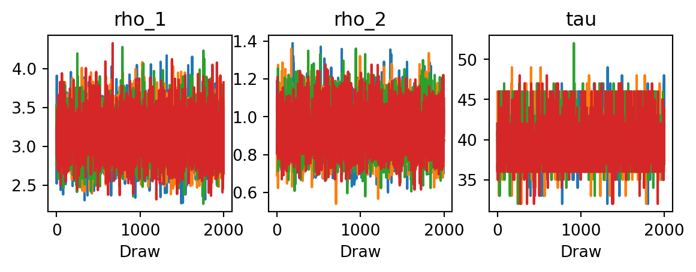{width="60%"}
:::

<div style="margin-bottom: 0.5em;"></div>

::: {.takeaway}
[What to look for]{.box-title}

- **Fuzzy caterpillars** — random noise around a stable level, chains overlapping
- **Trends or drift** — warmup too short, posterior hard to explore
- **Stuck regions** — sampler getting trapped, common with discrete parameters
- **Chain disagreement** — multiple modes, chains can't transition between them
:::

## Convergence Diagnostics: Rank Plots

Rank plots rank all samples across all chains, then checks each chain's ECDF against the diagonal

```{python}
#| echo: true
#| output: false
az.plot_rank(dt, var_names=["rho_1", "rho_2", "tau"])
```

::: {style="text-align: center;"}
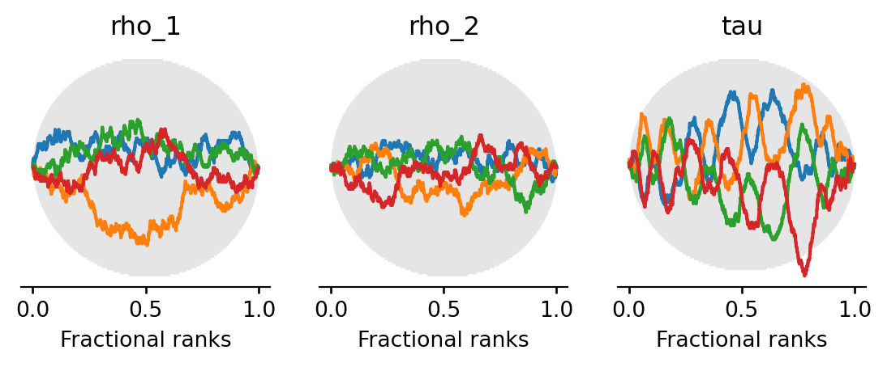{width="60%"}
:::

<div style="margin-bottom: 0.5em;"></div>

- More sensitive than trace plots to subtle problems (chains differing slightly in mean or variance)

::: {.sidenote}
If diagnostics fail, examine the **model**. Computational difficulties are often symptoms of modeling problems.
:::

<!-- ============================================================ -->
<!-- PART 7: EXPLORING POSTERIORS                                  -->
<!-- ============================================================ -->

## Joint Posterior

With convergence confirmed, we examine the full **joint posterior** over all parameters:

```{python}
#| echo: true
#| output: false
az.plot_pair(dt, var_names=["rho_1", "rho_2", "tau"], marginal=True)
```

::: {style="text-align: center;"}
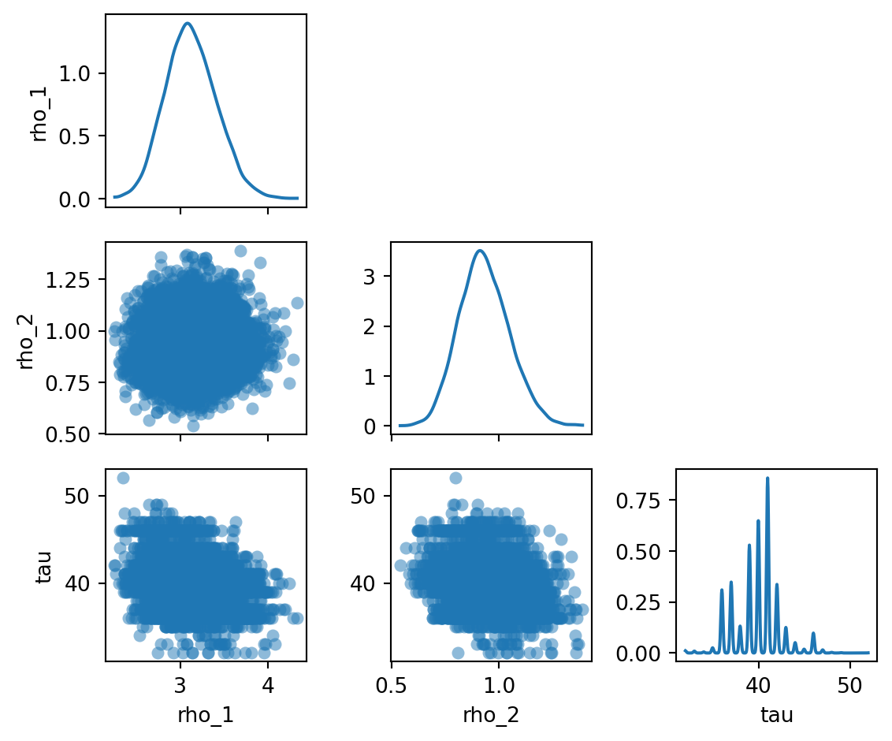{width="55%"}
:::

::: {.takeaway}
- $\rho_1$ and $\rho_2$ are nearly independent
- Slight negative correlation between $\rho_1$ and $\tau$: a later switchpoint (more years in the early regime) is associated with a lower early rate
:::

## Posterior Rate Trajectory

We now plot the posterior mean and 90% credible interval of the rate trajectory $\lambda_t$:

```{python}
#| echo: true
#| output: false
posterior_samples = mcmc.get_samples()
mean_rate = jnp.mean(posterior_samples["rate"], axis=0)
lower, upper = jnp.percentile(posterior_samples["rate"], jnp.array([5, 95]), axis=0)
```

<div style="margin-bottom: 1em;"></div>

::: {style="text-align: center;"}
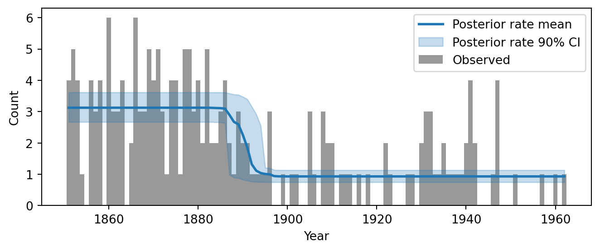{width="75%"}
:::

## Derived Quantities & Uncertainty Propagation

::: {.takeaway}
[Key principle]{.box-title}
Any quantity that is a **function of posterior samples** inherits uncertainty for free.
:::

<div style="margin-bottom: 1em;"></div>

**Example:** expected *disasters avoided* due to the rate change, $\Delta^{(s)} = (\rho_1^{(s)} - \rho_2^{(s)}) \times (T - \tau^{(s)})$:

```{python}
#| echo: true
#| output: false
rate_drop = posterior_samples["rho_1"] - posterior_samples["rho_2"]
years_after = n_years - posterior_samples["tau"]
delta = rate_drop * years_after
```

<div style="margin-bottom: 1em;"></div>

::: {style="text-align: center;"}
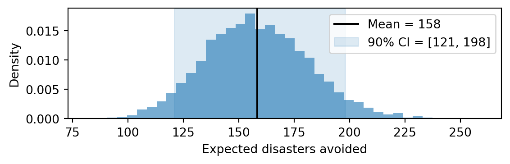{width="60%"}
:::


<!-- ============================================================ -->
<!-- PART 8: POSTERIOR PREDICTIVE CHECKS                           -->
<!-- ============================================================ -->

## Posterior Predictive Checks

**Question:** Does the fitted model generate data that *looks like* the observed data?


```{python}
#| echo: true
#| output: false
rng_key_ppc = random.PRNGKey(2)
posterior_pred = Predictive(model, posterior_samples=mcmc.get_samples())
ppc_samples = posterior_pred(rng_key_ppc, n_years=n_years, counts=None)
```

<div style="margin-bottom: 1em;"></div>

Same `Predictive` API as the prior predictive, but supply `posterior_samples`.

<div style="margin-bottom: 1em;"></div>

::: {.sidenote}
[Prior predictive vs. posterior predictive]{.box-title}
- **Prior predictive**: tests whether priors produce plausible data, *before* fitting
- **Posterior predictive**: tests whether the *fitted* model produces plausible data, *after* fitting
:::

## PPC: Replicated Counts Envelope

Unlike the rate envelope, this shows **observable counts**, including Poisson scatter:

```{python}
#| echo: true
#| output: false
import numpy as np
ppc_obs = np.array(ppc_samples["obs"])
ppc_mean = ppc_obs.mean(axis=0)
ppc_lower = np.percentile(ppc_obs, 5, axis=0)
ppc_upper = np.percentile(ppc_obs, 95, axis=0)
```

<div style="margin-bottom: 1em;"></div>

::: {style="text-align: center;"}
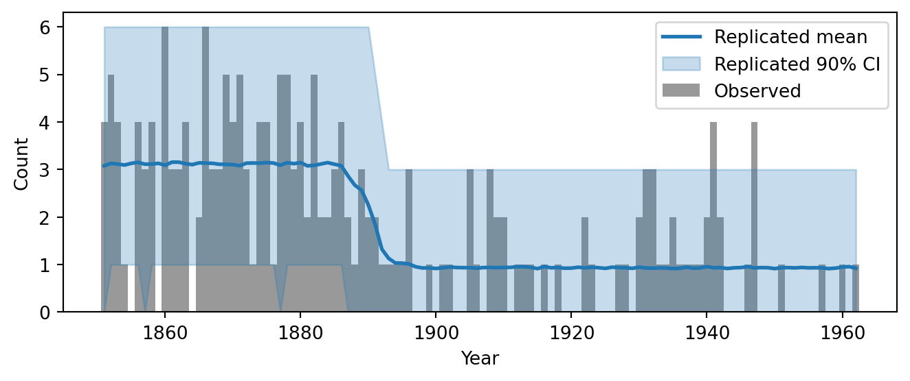{width="75%"}
:::


## PPC: Simulated Datasets

Individual draws from the posterior predictive:

::: {style="text-align: center;"}
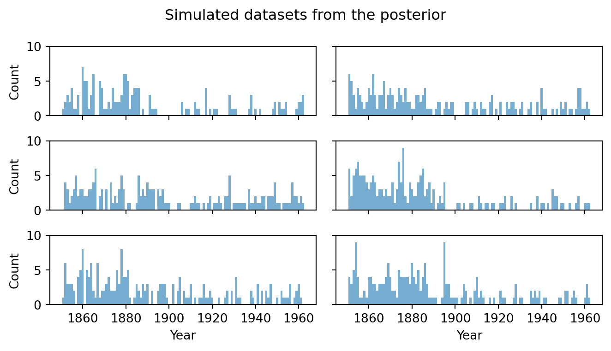{width="75%"}
:::


## PPC: Summary Statistics

::: {.definition}
- Choose **test quantities** that probe specific aspects of the model. 
- For each replicated dataset, compute the statistic and compare to the observed value (red line)
:::

<div style="margin-bottom: 1em;"></div>

::: {style="text-align: center;"}
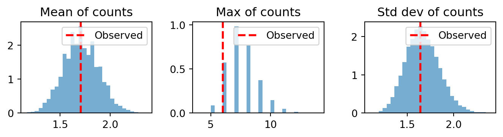{width="85%"}
:::

- Observed summary stats should fall within the distribution of replicated stats.


## PPC: Rootogram

A **rootogram** checks whether the model reproduces the *frequency* of each count value $k$:

<div style="margin-bottom: 2em;"></div>

::: {style="text-align: center;"}
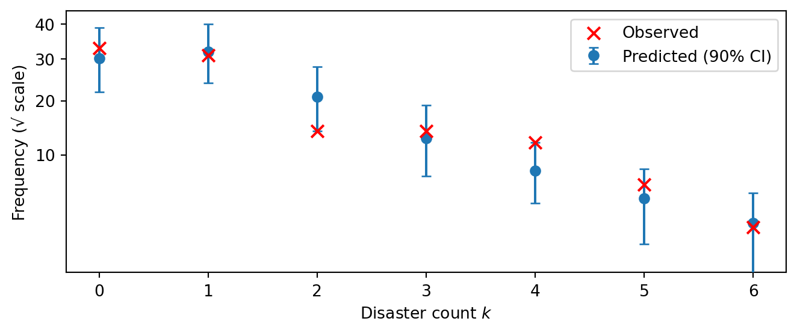{width="75%"}
:::


<!-- ============================================================ -->
<!-- PART 9: SENSITIVITY ANALYSIS                                  -->
<!-- ============================================================ -->

## Sensitivity Analysis

**Question:** Is the posterior driven by the *data* or the *prior*?

Rerunning the model with difference priors or likelihoods is expensive.

**Power-scaling** [@Kallioinen2024]: perturb prior or likelihood by raising it to a power $\alpha \approx 1$, then reweight existing samples via Pareto-smoothed importance sampling (PSIS).

<div style="margin-bottom: 1em;"></div>

::: {.definition}
| | Raises concern if | Interpretation |
|---|---|-------|
| Prior sensitivity | $> 0.05$ | prior is influencing the posterior |
| Likelihood sensitivity | $< 0.05$ | data contribute little; prior dominates |
:::

<div style="margin-bottom: 1em;"></div>

```{python}
#| echo: false
#| output: false
from numpyro.infer.util import log_density
import xarray as xr

dt = az.from_numpyro(
    mcmc, prior=prior_samples,
    posterior_predictive=ppc_samples,
    log_likelihood=True,
)

blocked_model = numpyro.handlers.block(model, hide=["obs"])
post_samples = mcmc.get_samples()
batched_params = {k: v for k, v in post_samples.items() if k != "rate"}

log_prior_vals = jax.vmap(
    lambda p: log_density(blocked_model, (n_years,), {"counts": counts}, p)[0]
)(batched_params)

n_chains, n_draws = mcmc.num_chains, log_prior_vals.shape[0] // mcmc.num_chains
lp_arr = np.array(log_prior_vals).reshape(n_chains, n_draws)
dt["log_prior"] = xr.DataTree(
    xr.Dataset({"prior": xr.DataArray(lp_arr, dims=["chain", "draw"])})
)
```

```{python}
#| echo: true
az.psense_summary(dt, var_names=["rho_1", "rho_2", "tau"])  #requires extending dt with log-likelihood and log-prior sites
```


<!-- ============================================================ -->
<!-- PART 10: MODEL COMPARISON                                     -->
<!-- ============================================================ -->

## Alternative Models

How do we know the change-point model is the right level of complexity? We compare it against two alternatives:

<div style="margin-bottom: 1em;"></div>

:::: {.definition}
:::: {.columns}
::: {.column width="33%"}
**Constant rate**

No change point.

*Maybe the apparent drop is just noise.*
:::
::: {.column width="33%"}
**Discrete change point**

Abrupt step at year $\tau$.

*Maybe the rate changed suddenly.*
:::
::: {.column width="33%"}
**Sigmoid change point**

Smooth logistic transition. Width $s$ inferred from data.

*Maybe the transition was gradual.*
:::
::::
::::

<div style="margin-bottom: 1em;"></div>

- Each model is a different scientific hypothesis about the disaster process. 
- Model comparison will tell us which is best supported by the data.

## Constant-Rate Model

Single Poisson rate across all years:

```{python}
#| echo: true
#| output: false
def model_constant(n_years, counts=None):
    alpha = 1.0 / 3.0
    rho = numpyro.sample("rho", dist.Exponential(alpha))
    lambda_t = jnp.full(n_years, rho)
    numpyro.deterministic("rate", lambda_t)
    numpyro.sample("obs", dist.Poisson(lambda_t), obs=counts)

kernel_const = NUTS(model_constant)
mcmc_const = MCMC(kernel_const, num_warmup=1000, num_samples=2000, num_chains=4)
mcmc_const.run(random.PRNGKey(10), n_years, counts=counts)
```

```{python}
#| echo: true
az.summary(az.from_numpyro(mcmc_const), var_names=["rho"])
```

## Sigmoid Change-Point Model

Replace the hard step with a smooth **sigmoid** transition:

$$
\lambda_t = \rho_2 + (\rho_1 - \rho_2) \cdot \sigma\!\left(-\tfrac{t - \tau}{s}\right), \qquad \sigma(x) = \frac{1}{1+e^{-x}}
$$

Width $s \to 0$ recovers the original discrete model; Large $s$ = gradual transition

```{python}
#| echo: true
#| output: false
def model_sigmoid(n_years, counts=None):
    alpha = 1.0 / 3.0
    rho_1 = numpyro.sample("rho_1", dist.Exponential(alpha))
    rho_2 = numpyro.sample("rho_2", dist.Exponential(alpha))
    tau   = numpyro.sample("tau", dist.Uniform(0, n_years))
    s     = numpyro.sample("s", dist.HalfNormal(10.0))

    ts = jnp.arange(n_years, dtype=jnp.float32)
    weight = jax.nn.sigmoid(-(ts - tau) / s)
    lambda_t = rho_2 + (rho_1 - rho_2) * weight
    numpyro.deterministic("rate", lambda_t)
    numpyro.sample("obs", dist.Poisson(lambda_t), obs=counts)

kernel_sig = NUTS(model_sigmoid)
mcmc_sig = MCMC(kernel_sig, num_warmup=1000, num_samples=2000, num_chains=4)
mcmc_sig.run(random.PRNGKey(30), n_years, counts=counts)
```


## Sigmoid Model: Posterior Rate

```{python}
#| echo: true
dt_sig = az.from_numpyro(mcmc_sig, log_likelihood=True)
az.summary(dt_sig, var_names=["rho_1", "rho_2", "tau", "s"])
```

::: {style="text-align: center;"}
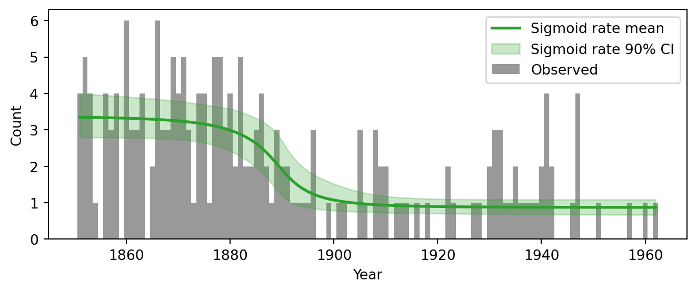{width="75%"}
:::

## From External Validation to LOO-CV

**Gold standard**: Fit on training data, score predictions on a held-out test set using the **log predictive density**:

$$
\text{lpd}_{\text{test}} = \sum_{t \in \text{test}} \log p(y_t \mid y_{\text{train}})
$$

. . .

But we have only 112 years of data, and time-series structure complicates splitting. **Cross-validation** simulates held-out data from the training set itself:

:::: {.columns}
::: {.column width="50%"}
::: {.definition}
[$K$-fold CV]{.box-title}
Split into $K$ subsets; each takes a turn as the test set. Sum the $K$ log predictive densities.
:::
:::
::: {.column width="50%"}
::: {.definition}
[Leave-one-out CV ($K = T$)]{.box-title}
Each observation is held out in turn. Least biased estimate — but requires $T$ separate model fits.
:::
:::
::::

. . .

::: {.warning}
- Each Bayesian "fit" means a full MCMC run. $T = 112$ refits is prohibitive.
- LOO-CV approximates the leave-one-out predictive performance using a single fit.
:::

## LOO-CV Comparison

```{python}
#| echo: false
#| output: false
dt_const = az.from_numpyro(mcmc_const, log_likelihood=True)
dt_cp = dt  # dt rebuilt with log_likelihood in the sensitivity section
```

```{python}
#| echo: true
comparison = az.compare({
    "Constant rate":        dt_const,
    "Discrete change point": dt_cp,
    "Sigmoid change point": dt_sig,
})
comparison
```

::: {style="text-align: center;"}
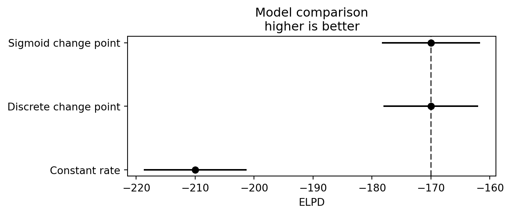{width="75%"}
:::


## LOO Diagnostics: Pareto $\hat{k}$

```{python}
#| echo: true
#| output: false
loo_cp = az.loo(dt_cp, var_name="obs")
az.plot_khat(loo_cp)
```

::: {style="text-align: center;"}
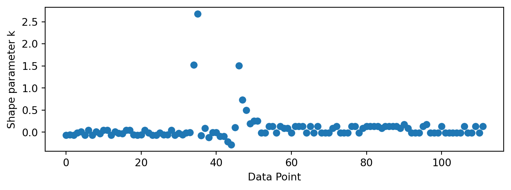{width="70%"}
:::

- Problematic observations cluster **near the change point** — removing one of them substantially shifts the posterior on $\tau$
- That large posterior shift makes importance-sampling reweighting unstable

<!-- ============================================================ -->
<!-- PART 11: SUMMARY & MODELING TIPS                              -->
<!-- ============================================================ -->

## Summarizing Results

Back to the original questions:

::: {.takeaway}
[1. When did the rate change?]{.box-title}

Posterior on $\tau$ concentrates around **1890** — coinciding with UK coal mining safety legislation.
:::

::: {.takeaway}
[2. By how much did it change?]{.box-title}

- Early rate $\rho_1 \approx 3$ disasters/year drops to $\rho_2 \approx 1$. 
- Expected disasters avoided $\Delta$ — an interpretable derived quantity — has full posterior uncertainty.
:::

::: {.takeaway}
[3. Is there evidence for a change at all?]{.box-title}

**Yes** — LOO-CV strongly prefers both change-point models over the constant-rate baseline. The data cannot distinguish an abrupt from a gradual transition.
:::

<div style="margin-bottom: 1em;"></div>

::: {.definition}
[Conclusions are robust]{.box-title}
PPC & rootogram: no systematic bias. Power-scaling: posterior driven by data, not priors.
:::

## The Folk Theorem of Statistical Computing

> *"When you have computational problems, often there's a problem with your model."*
> — @GelmanBayesianWorkflow2020

<div style="margin-bottom: 1em;"></div>

::: {.takeaway}
[A mental ladder]{.box-title}

1. **Poor MCMC mixing** indicates...
2. **Difficult posterior geometry** — often caused by...
3. **Weakly informative data** for some parameter — can be resolved by...
4. **Adding prior information you already have**
:::

<div style="margin-bottom: 1em;"></div>

**Example:** a sampler that struggles with the change-point model may be reacting to priors that place mass on implausible rates (in the hundreds). Tightening the prior smooths the landscape and often resolves the issue.

## Modeling Tips

::: {.takeaway}
[Fit fast, fail fast]{.box-title}

Early models are provisional. Start with short chains — bugs, bad priors, and identifiability issues show up quickly. Invest in long runs only once short runs pass.
:::


::: {.takeaway}
[Start simple, build up]{.box-title}

Fit the simplest model first. Let PPC failures tell you *what to add next*. Models built incrementally are understood at every stage.


::: {.takeaway}
[Modularize]{.box-title}

Share priors, likelihoods, and utilities across models. In our example only the construction of $\lambda_t$ changed between constant, discrete, and sigmoid.
:::


## References