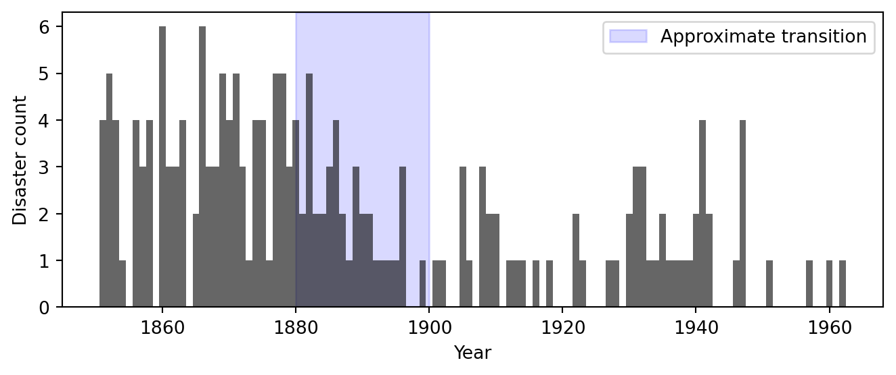
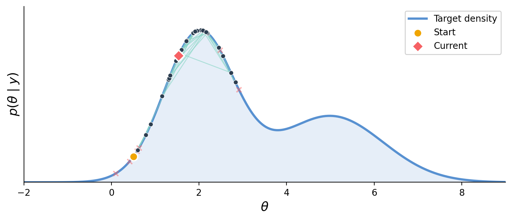
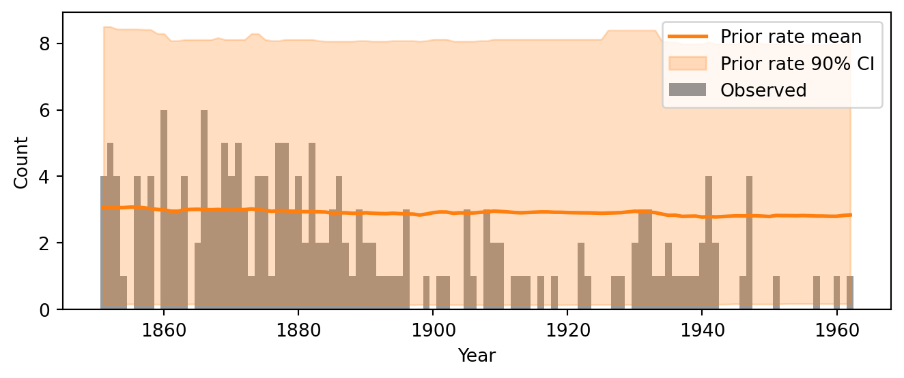
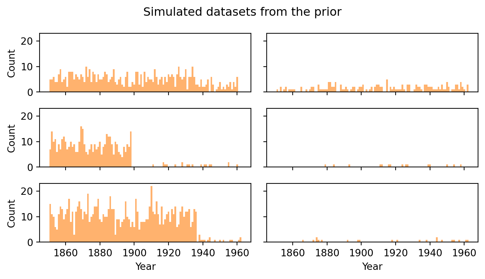
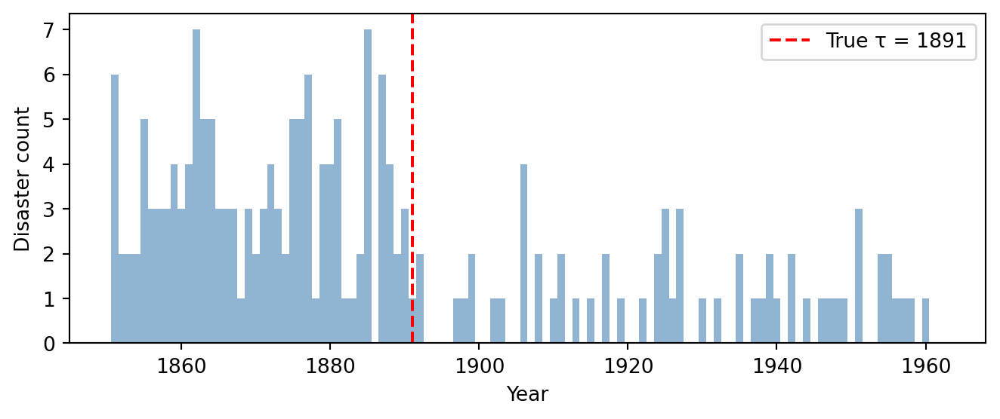
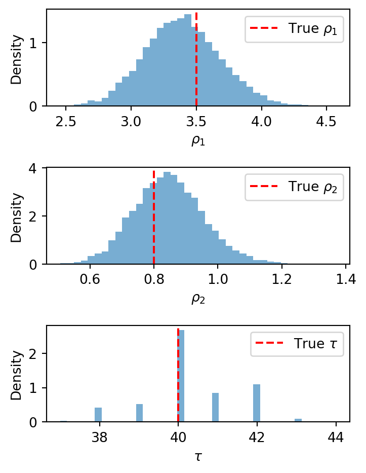

```{python}
#| echo: false
#| output: false
import jax
from jax import random
import jax.numpy as jnp

import numpyro
import numpyro.distributions as dist
from numpyro.infer import MCMC, NUTS, Predictive, DiscreteHMCGibbs

import arviz as az

rng_key = random.PRNGKey(42)

years = jnp.arange(1851, 1963)
n_years = len(years)
counts = jnp.array([
    4, 5, 4, 1, 0, 4, 3, 4, 0, 6, 3, 3, 4, 0, 2, 6, 3, 3, 5, 4, 5, 3,
    1, 4, 4, 1, 5, 5, 3, 4, 2, 5, 2, 2, 3, 4, 2, 1, 3, 2, 2, 1, 1, 1,
    1, 3, 0, 0, 1, 0, 1, 1, 0, 0, 3, 1, 0, 3, 2, 2, 0, 1, 1, 1, 0, 1,
    0, 1, 0, 0, 0, 2, 1, 0, 0, 0, 1, 1, 0, 2, 3, 3, 1, 1, 2, 1, 1, 1,
    1, 2, 4, 2, 0, 0, 0, 1, 4, 0, 0, 0, 1, 0, 0, 0, 0, 0, 1, 0, 0, 1,
    0, 1
])

def model(n_years, counts=None):
    alpha = 1.0 / 3.0
    rho_1 = numpyro.sample("rho_1", dist.Exponential(alpha))
    rho_2 = numpyro.sample("rho_2", dist.Exponential(alpha))
    tau = numpyro.sample("tau", dist.Categorical(
        probs=jnp.ones(n_years) / n_years))
    idx = jnp.arange(n_years)
    lambda_t = jnp.where(idx < tau, rho_1, rho_2)
    numpyro.deterministic("rate", lambda_t)
    numpyro.sample("obs", dist.Poisson(lambda_t), obs=counts)

idx = jnp.arange(n_years)
rng_key_sim = random.PRNGKey(42)
```

## The Bayesian Workflow

::::: {.takeaway}
:::: {.columns}
::: {.column width="33%"}
**Modeling**

1. Explore data
2. Conceive a model
3. Implement as code
4. Choose & check priors
:::
::: {.column width="33%"}
**Inference**

5. Simulate fake data
6. Run inference
7. Diagnose convergence
:::
::: {.column width="33%"}
**Evaluation**

8. Explore posteriors
9. Posterior predictive checks
10. Sensitivity & comparison
:::
::::
:::::

These steps are *iterative* — we often loop back to revise the model after a check reveals a problem.

## The Bayesian Workflow
![Bayesian workflow overview [@GelmanBayesianWorkflow2020].](images/workflow_overview.png){width="75%"}

## Uk Coal Mining Disasters

::: {style="text-align: center;"}
{width="70%"}
:::

. . .


::: {.definition .w-40}
[Questions]{.box-title}

1. **When** did the disaster rate change?
2. **By how much** did it change?
3. **Is there evidence** for a change at all?
:::

<!-- ============================================================ -->
<!-- PART 2: MODEL SPECIFICATION                                   -->
<!-- ============================================================ -->

## The Change-Point Model

Disasters in year $t$ occur at some rate $\lambda_t$. 
$$
y_t \sim \text{Poisson}(\lambda_t)
$$

. . .

At an unknown year $\tau$, the rate switches:

$$
\lambda_t = \begin{cases} \rho_1 & \text{if } t < \tau, \\ \rho_2 & \text{if } t \geq \tau. \end{cases}
$$

Three unknowns: early rate $\rho_1$, late rate $\rho_2$, switchpoint $\tau$.

. . .

<div style="margin-bottom: 2em;"></div>

:::: {.columns}
::: {.column width="50%"}
::: {.takeaway}
[Full model]{.box-title}

$$
\begin{aligned}
\rho_1 &\sim \text{Exponential}(\alpha), \\
\rho_2 &\sim \text{Exponential}(\alpha), \\
\tau &\sim \text{Categorical}\!\left(\tfrac{1}{T}, \ldots, \tfrac{1}{T}\right), \\
y_t &\sim \text{Poisson}(\lambda_t), \quad t = 1, \ldots, T.
\end{aligned}
$$
:::
:::

::: {.column width="50%" style="text-align: center;"}
{width="60%"}
:::
::::

<!-- ============================================================ -->
<!-- PART 3: IMPLEMENTATION                                        -->
<!-- ============================================================ -->

## Software: NumPyro + ArviZ


**NumPyro** — JAX-based PPL

- Models are Python functions with sampling statements.

::: {style="text-align: center;"}
{width="60%"}
:::

::: {.sidenote}
[Markov chain Monte Carlo]{.box-title}
Explores the posterior via random proposals: accepted moves (green) walk along the density; rejected proposals (red ×) are discarded. Produces *correlated* samples — diagnostics needed.
:::

**ArviZ** — posterior diagnostics and visualization.

## Implementing in NumPyro

Each line of the math maps to a `numpyro.sample` call:


<div style="margin-bottom: 2em;"></div>

| Math | NumPyro |
|------|---------------|
| $\rho_1 \sim \text{Exp}(\alpha)$ | `numpyro.sample("rho_1", dist.Exponential(alpha))` |
| $\tau \sim \text{Cat}(1/T, \ldots)$ | `numpyro.sample("tau", dist.Categorical(probs=...))` |
| $y_t \sim \text{Poisson}(\lambda_t)$ | `numpyro.sample("obs", dist.Poisson(rate), obs=counts)` |

. . .

<div style="margin-bottom: 2em;"></div>

::: {.definition}
[The `obs` keyword — dual-purpose design]{.box-title}

- `obs=None` → **draw** from the distribution (generative / simulation)
- `obs=counts` → **score** observed data (conditioning for inference)

One function serves as both generative model and conditioned model.
:::

## The Model Function

```{.python code-line-numbers="1-8|10-13|15-16"}
def model(n_years, counts=None):
    alpha = 1.0 / 3.0

    # Priors
    rho_1 = numpyro.sample("rho_1", dist.Exponential(alpha))
    rho_2 = numpyro.sample("rho_2", dist.Exponential(alpha))
    tau = numpyro.sample("tau", dist.Categorical(
        probs=jnp.ones(n_years) / n_years))

    # Piecewise-constant rate vector
    idx = jnp.arange(n_years)
    lambda_t = jnp.where(idx < tau, rho_1, rho_2)
    numpyro.deterministic("rate", lambda_t)

    # Likelihood (or generative sampling)
    numpyro.sample("obs", dist.Poisson(lambda_t), obs=counts)
```

<div style="margin-bottom: 1em;"></div>

::: {.sidenote}
- `jnp.where` builds the rate vector — vectorized, no Python loop
- `numpyro.deterministic` records computed quantities for later inspection
:::

## Debugging: Tracing Shapes

Run the model once in **trace** mode to inspect all site shapes:

<div style="margin-bottom: 1em;"></div>

```python
with numpyro.handlers.seed(rng_seed=0):
    trace = numpyro.handlers.trace(model).get_trace(
        n_years=n_years, counts=None)

for name, site in trace.items():
    if site["type"] in ("sample", "deterministic"):
        print(f"{name:8s}  shape={site['value'].shape}")
```

```
rho_1     shape=()
rho_2     shape=()
tau       shape=()
rate      shape=(112,)
obs       shape=(112,)
```

<div style="margin-bottom: 1em;"></div>

::: {.sidenote}
If a shape looks unexpected, this is the quickest way to catch it.
:::

<!-- ============================================================ -->
<!-- PART 4: PRIORS & PRIOR PREDICTIVE CHECKS                      -->
<!-- ============================================================ -->

## Choosing Priors

Priors fall on a spectrum:

<div style="margin-bottom: 1em;"></div>

| | |
|---|---|
| **Informative** | Encodes specific domain knowledge |
| **Weakly informative** | Excludes implausible values, stays broad |
| **Uninformative** | Flat / maximal ignorance |

<div style="margin-bottom: 2em;"></div>

::: {.warning}
[Never assign zero prior probability]{.box-title}
Unless a value is *truly impossible*. If the prior is zero somewhere, no amount of data can move the posterior there.
:::

. . .

<div style="margin-bottom: 2em;"></div>

Our choices: 

- $\text{Exp}(1/3)$ for rates (mean = 3, sd = 3)
- Uniform $\text{Categorical}$ for $\tau$.


## Prior Predictive Checks

**Idea:** simulate data from the prior *before* fitting. Does the model produce plausible datasets?

<div style="margin-bottom: 2em;"></div>

```python
prior_predictive = Predictive(model, num_samples=500)
prior_samples = prior_predictive(rng_key, n_years=n_years, counts=None)
```

<div style="margin-bottom: 2em;"></div>

Each draw produces a full parameter set ($\rho_1, \rho_2, \tau$), a rate trajectory, and a synthetic count vector.

<div style="margin-bottom: 2em;"></div>

::: {.sidenote}
This is the first use of the model's **dual-purpose design**: calling with `counts=None` generates data.
:::

## Prior Predictive: Rate Envelope

::: {style="text-align: center;"}
{width="70%"}
:::

<div style="margin-bottom: 0.5em;"></div>

- Wide envelope reflects vague prior — observed data falls well within it
- If envelope were too narrow or missed the data, priors need revision

## Prior Predictive: Simulated Datasets

::: {style="text-align: center;"}
{width="70%"}
:::

<div style="margin-bottom: 0.5em;"></div>

- Counts are in single digits with visible changepoints — qualitatively plausible
- When in doubt, err on the side of *more diffuse* priors

<!-- ============================================================ -->
<!-- PART 5: FAKE-DATA SIMULATION                                  -->
<!-- ============================================================ -->

## Fake-Data Simulation

Generate a synthetic dataset with **known** parameters — a test bed where we know the truth.

<div style="margin-bottom: 1em;"></div>

```{python}
#| output: false
true_rho_1 = 3.5
true_rho_2 = 0.8
true_tau = 40   # corresponds to year 1891

true_lambda = jnp.where(idx < true_tau, true_rho_1, true_rho_2)
fake_counts = dist.Poisson(true_lambda).sample(rng_key_sim)
```

<div style="margin-bottom: 1em;"></div>

::: {.sidenote}
If the sampler can't recover known parameters on fake data, we shouldn't trust it on real data.
:::

## Simulated Fake Data

::: {style="text-align: center;"}
{width="70%"}
:::

<div style="margin-bottom: 0.5em;"></div>

- Qualitative structure matches the observed data — single-digit counts with a visible drop
- We will run inference on this fake data first, then check parameter recovery

<!-- ============================================================ -->
<!-- PART 6: RUNNING INFERENCE                                     -->
<!-- ============================================================ -->

## Setting Up the Sampler

Our model mixes **discrete** ($\tau$) and **continuous** ($\rho_1, \rho_2$) parameters (standard NUTS doesn't work).

<div style="margin-bottom: 1em;"></div>

```{python}
#| output: false
kernel = DiscreteHMCGibbs(NUTS(model), modified=True)
mcmc = MCMC(kernel, num_warmup=1000, num_samples=2000, num_chains=4)
```

<div style="margin-bottom: 1em;"></div>

| Component | Role |
|-----------|------|
| `NUTS(model)` | Gradient-based sampler for continuous parameters |
| `DiscreteHMCGibbs` | Gibbs layer that enumerates over discrete $\tau$ |
| `num_warmup=1000` | Tuning draws (discarded) |
| `num_samples=2000` | Posterior draws per chain |
| `num_chains=4` | Independent chains for convergence checks |

## Parameter Recovery on Fake Data

```{python}
#| echo: true
#| output: false
mcmc.run(random.PRNGKey(1), n_years, counts=fake_counts)
idata_fake = az.from_numpyro(mcmc)
```

```{python}
#| echo: true
az.summary(idata_fake, var_names=["rho_1", "rho_2", "tau"])
```

<div style="margin-bottom: 1em;"></div>

::: {.takeaway}
[Check]{.box-title}
True values ($\rho_1 = 3.5$, $\rho_2 = 0.8$, $\tau = 40$) should fall within the 89% credible intervals. If recovery fails — debug before touching real data.
:::

## Fake-Data Posterior Marginals

::: {style="text-align: center;"}
{width="70%"}
:::

<div style="margin-bottom: 0.5em;"></div>

- True values land comfortably within the posteriors — the pipeline is working
- Parameters are identifiable from data of this size

## Inference on Observed Data
<!-- Run mcmc on real counts.
     Transition to diagnostics before interpreting results. -->

## Convergence Diagnostics: Numerical
<!-- az.summary output: mean, sd, 89% ETI, R-hat, ESS, MCSE.
     Explain each diagnostic and its threshold. -->

## Convergence Diagnostics: Trace Plots
<!-- Trace plots (fig-trace-plots): fuzzy caterpillars = good mixing.
     What to look for: trends, stuck regions, chain disagreement. -->

## Convergence Diagnostics: Rank Plots
<!-- Rank plots (fig-rank-plots): ECDFs should follow diagonal.
     More sensitive than trace plots to subtle problems. -->

<!-- ============================================================ -->
<!-- PART 7: EXPLORING POSTERIORS                                  -->
<!-- ============================================================ -->

## Joint Posterior
<!-- Pair plot (fig-posterior-pair): pairwise joint + marginals.
     Note: rho_1/rho_2 nearly independent; slight rho_1–tau correlation. -->

## Posterior Rate Trajectory
<!-- Plot (fig-posterior-rate): posterior mean + 90% CI of rate overlaid on data.
     Compare with prior predictive envelope — dramatic collapse of uncertainty. -->

## Derived Quantities: Disasters Avoided
<!-- Formula: Delta = (rho_1 - rho_2) * (T - tau).
     Code: one line of arithmetic on posterior samples.
     Histogram (fig-disasters-avoided) with mean + 90% CI. -->

## Uncertainty Propagation
<!-- Key principle: any function of posterior samples inherits uncertainty for free.
     No analytic variance formulas needed. -->

<!-- ============================================================ -->
<!-- PART 8: POSTERIOR PREDICTIVE CHECKS                           -->
<!-- ============================================================ -->

## Posterior Predictive Checks
<!-- Purpose: does the model generate data that looks like the observed data?
     Contrast with prior predictive (tests priors vs. tests full model).
     Formula for posterior predictive distribution. -->

## PPC: Replicated Counts Envelope
<!-- Plot (fig-ppc-counts): observed bars + replicated mean & 90% CI.
     Code: Predictive with posterior_samples. -->

## PPC: Simulated Datasets
<!-- Grid of 6 replicated datasets (fig-ppc-obs).
     Compare with prior predictive draws — much tighter. -->

## PPC: Summary Statistics
<!-- Three-panel plot (fig-ppc-stats): mean, max, std dev.
     Histogram of replicated statistic vs. observed (red line).
     Detecting overdispersion. -->

## PPC: Rootogram
<!-- Plot (fig-ppc-rootogram): observed vs. predicted count frequencies (sqrt scale).
     Specialized diagnostic for count data. -->

<!-- ============================================================ -->
<!-- PART 9: SENSITIVITY ANALYSIS                                  -->
<!-- ============================================================ -->

## Sensitivity Analysis
<!-- Motivation: is the posterior driven by data or prior?
     Power-scaling sensitivity analysis (Kallioinen et al. 2024).
     Idea: perturb prior/likelihood by power alpha, reweight via PSIS. -->

## Building the DataTree
<!-- Code: az.from_numpyro with log_likelihood=True.
     Computing log-prior via numpyro log_density + block. -->

## Power-Scaling Sensitivity Results
<!-- az.psense_summary output.
     Thresholds: prior sensitivity > 0.05, likelihood sensitivity < 0.05.
     Interpretation for rho_1, rho_2, tau. -->

<!-- ============================================================ -->
<!-- PART 10: MODEL COMPARISON                                     -->
<!-- ============================================================ -->

## Model Comparison: Overview
<!-- Three models: constant rate, discrete changepoint, sigmoid changepoint.
     Cross-validation via LOO-CV with PSIS. -->

## Constant-Rate Model
<!-- Code: model_constant (single rho, no changepoint).
     Fit with plain NUTS. -->

## Sigmoid Change-Point Model
<!-- Equation: lambda_t via sigmoid with width s.
     Code: model_sigmoid. HalfNormal(10) prior on s.
     All continuous → plain NUTS. -->

## Sigmoid Model: Posterior Rate
<!-- Plot (fig-sigmoid-rate): sigmoid posterior rate trajectory.
     az.summary for rho_1, rho_2, tau, s. -->

## LOO-CV Comparison
<!-- az.compare table: elpd_loo, se, p_loo, weight.
     Plot (fig-loo-compare). -->

## LOO Diagnostics: Pareto k-hat
<!-- Plot (fig-khat): problematic observations near changepoint.
     Explanation: influential observations ↔ unstable importance weights. -->

<!-- ============================================================ -->
<!-- PART 11: SUMMARY & MODELING TIPS                              -->
<!-- ============================================================ -->

## Summarizing Results
<!-- Key findings: rho_1 ≈ 3, rho_2 ≈ 1, tau ≈ 1890.
     PPC and sensitivity confirm robustness.
     Both changepoint models preferred over constant; sigmoid is practical default. -->

## The Folk Theorem of Statistical Computing
<!-- "When you have computational problems, often there's a problem with your model."
     Ladder: poor mixing → difficult geometry → weak data → add prior info. -->

## Modeling Tips
<!-- Fit fast, fail fast: start with short chains.
     Start simple, build up: simplest model first, add complexity iteratively.
     Modularize: swap components without rewriting everything. -->

